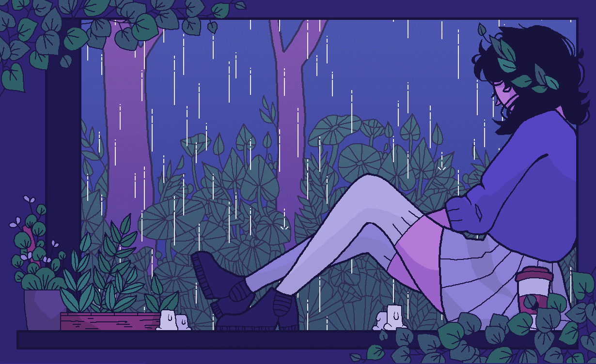

<a id="top"></a>

<div align="center">

<!-- Banner principal: coloque o arquivo como janela.gif na raiz do repositório -->


# 💜 Scarlet

### `AI Builder • Python Developer • Minecraft Modder • Discord Bot Creator`


<p>
  <a href="#sobre"></a>
  <a href="#agora"></a>
  <a href="#stack"></a>
  <a href="#projetos"></a>
  <a href="#stats"></a>
</p>

</div>

---

<a id="sobre"></a>
## ✦ Sobre mim

> *“Eu gosto de pegar uma ideia estranha, transformar em código e descobrir até onde ela consegue chegar.”*

Eu sou **Scarlet**, também conhecido como **saycat25**. Meu foco é transformar ideias em sistemas funcionais, principalmente envolvendo **Inteligência Artificial, Python, Discord, Minecraft, automação e integrações entre ferramentas**.

Não gosto muito de projetos que terminam em uma única tela ou em um único comando. Prefiro construir coisas que possam **conversar entre si, ganhar novas funções e continuar crescendo**.

```python
scarlet = {
    "role": "AI Builder / Developer",
    "focus": [
        "AI systems",
        "agents + memory",
        "Discord automation",
        "Minecraft projects",
        "modular architecture",
    ],
    "principle": "primeiro funciona, depois fica bonito, depois fica melhor ainda",
    "status": "provavelmente criando mais um módulo",
}
```

<div align="center">

`🤖 IA` &nbsp; `🐍 Python` &nbsp; `💬 Discord` &nbsp; `🎮 Minecraft` &nbsp; `⚙️ Automação` &nbsp; `🧩 Sistemas Modulares`

</div>

---

<a id="agora"></a>
## ♡ Construindo agora

### 🧠 Hanako

A **Hanako** é uma das ideias centrais dos meus projetos: uma IA modular pensada para ir além de uma simples interface de chat.

```text
Hanako
│
├── 🧠 LLM Providers
├── 💾 Memory
├── 🔎 RAG
├── 🤖 Agents
├── 🛠️ Tools
├── 🔐 Permissions
├── 👤 Sessions
├── 🧩 Modules
├── 🎙️ Voice
├── 💬 Discord
├── 🖥️ GUI
└── 🌐 API
```

A ideia é poder adicionar capacidades novas sem transformar o projeto inteiro em um arquivo gigantesco.

### 💬 Discord Systems

Também gosto de usar o Discord como uma interface para sistemas maiores:

```text
Discord
   │
   ├── Commands
   ├── Events
   ├── Permissions
   ├── AI
   ├── Memory
   ├── Tools
   └── Integrations
          │
          ▼
       Backend
```

---

<a id="stack"></a>
## ✧ Stack & Tecnologias

<div align="center">

### 🐍 Linguagens


### 🤖 IA & Sistemas


### 🎮 Game Development


### 🛠️ Ferramentas


</div>

---

<a id="projetos"></a>
## ☾ Projetos

<div align="center">

<a href="https://github.com/saycat25/skynet">

</a>

<a href="https://github.com/saycat25/SigillareForms">

</a>

<a href="https://github.com/saycat25/plugin-pessoal-beta">

</a>

<a href="https://github.com/saycat25/instabtcoin">

</a>

<a href="https://github.com/saycat25/guardian-whisper-46">

</a>

<a href="https://github.com/saycat25/MrBeast-Plugin">

</a>

</div>

### 🧠 Hanako

Arquitetura de IA modular com memória, RAG, ferramentas, sessões, permissões e integrações.

### 🎮 Minecraft Projects

Projetos envolvendo **NeoForge**, mods, comandos, personagens, dimensões, interfaces e mecânicas personalizadas.

### ⚙️ Experimental Tools

Ideias, automações, APIs e ferramentas que começam pequenas e acabam virando sistemas maiores.

---

## 🧩 Arquitetura

Eu tento evitar:

```text
❌ projeto.py
   ├── tudo
   ├── mais tudo
   ├── absolutamente tudo
   └── socorro
```

E prefiro:

```text
project/
│
├── core/
│   ├── engine/
│   ├── memory/
│   ├── sessions/
│   └── permissions/
│
├── modules/
│   ├── ai/
│   ├── tools/
│   └── integrations/
│
├── interfaces/
│   ├── discord/
│   ├── gui/
│   └── api/
│
└── config/
    └── environment/
```

> **Modularidade é o que permite que uma ideia continue crescendo sem virar um caos.**

---

<a id="stats"></a>
## ✦ Estatísticas

<div align="center">


<br><br>


</div>

---

## 🌌 Filosofia

> **“Se dá para transformar uma ideia em código, então vale a pena tentar.”**

Muitos projetos começam com uma pergunta simples:

```text
"Será que dá para fazer isso?"
```

Depois vêm os testes, os bugs, as melhorias e, eventualmente:

```text
"Por que isso tem 14 módulos?"
```

É justamente essa parte que eu gosto.

---

## 🩵 Roadmap

```text
[✓] Criar projetos próprios
[✓] Trabalhar com Python
[✓] Criar bots
[✓] Explorar IA
[✓] Criar sistemas modulares
[✓] Explorar desenvolvimento de Minecraft
[ ] Expandir a Hanako
[ ] Criar mais ferramentas próprias
[ ] Criar APIs para os projetos
[ ] Melhorar interfaces e GUIs
[ ] Publicar projetos maiores
[ ] Transformar ideias experimentais em produtos completos
```

---

## 💻 Setup

```text
OS              → Windows
Main Language   → Python
Editor          → VS Code
Version Control → Git + GitHub

Interests:
├── AI
├── Minecraft
├── Discord
├── Automation
├── Backend
└── Experimental Projects
```

---

<div align="center">

<a href="https://github.com/saycat25">

</a>

<br><br>

### 🪻 Obrigado por visitar meu perfil!

<sub>Construindo coisas, quebrando coisas e tentando descobrir como fazer as duas coisas ao mesmo tempo.</sub>

<br><br>


</div>
